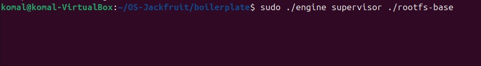
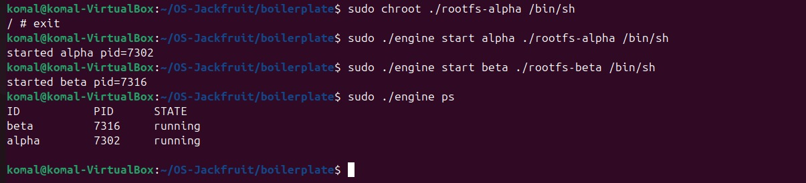
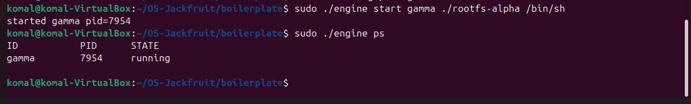
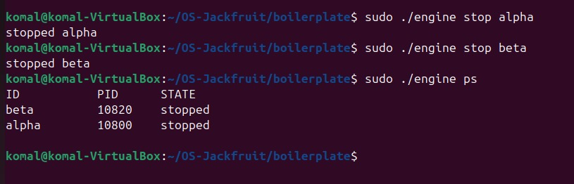

# Multi-Container Runtime

A lightweight Linux container runtime in C with a long-running supervisor and a kernel-space memory monitor.

## Team Information

| Name | SRN |
|------|-----|
| Komal Sajja | YOUR_SRN |
| Teammate Name | TEAMMATE_SRN |

## 1. Build, Load, and Run Instructions

### Prerequisites

* Ubuntu 22.04 or 24.04 (VM)
* Secure Boot OFF
* Linux kernel headers installed

```bash
sudo apt update
sudo apt install -y build-essential linux-headers-$(uname -r)
```

---

### Setup

```bash
git clone https://github.com/Komal-S-Sajja/OS-Jackfruit.git
cd OS-Jackfruit

mkdir rootfs-base
wget https://dl-cdn.alpinelinux.org/alpine/v3.20/releases/x86_64/alpine-minirootfs-3.20.3-x86_64.tar.gz

sudo tar -xzf alpine-minirootfs-3.20.3-x86_64.tar.gz -C rootfs-base

cp -a rootfs-base rootfs-alpha
cp -a rootfs-base rootfs-beta
```

---

### Build

```bash
cd boilerplate
sudo make

cp cpu_hog memory_hog io_pulse ../rootfs-alpha/
cp cpu_hog memory_hog io_pulse ../rootfs-beta/
```

---

### Load Module

```bash
sudo insmod monitor.ko
ls -l /dev/container_monitor
sudo dmesg | tail
```

---

### Run

#### Terminal 1 (Supervisor)

```bash
sudo ./engine supervisor ../rootfs-base
```

#### Terminal 2 (Containers)

```bash
sudo ./engine start alpha ../rootfs-alpha /bin/sleep 100
sudo ./engine start beta  ../rootfs-beta  /bin/sleep 100

sudo ./engine ps
sudo ./engine logs alpha
```

---

### Additional Tests

```bash
sudo ./engine run test ../rootfs-alpha ./cpu_hog
sudo ./engine run test ../rootfs-alpha ./memory_hog
```

---

### Cleanup

```bash
sudo ./engine stop alpha
sudo ./engine stop beta
sudo rmmod monitor
sudo dmesg | tail
```

---

## 2. Demo Screenshots

| # | What                        | Screenshot                               |
| - | --------------------------- | ---------------------------------------- |
| 1 | Multi-container supervision |  |
| 2 | Metadata tracking           |         |
| 3 | Logging                     |          |
| 4 | CLI and IPC                 |          |
| 5 | Soft-limit warning          |       |
| 6 | Hard-limit enforcement      |       |
| 7 | Scheduling experiment       |       |
| 8 | Clean teardown              |          |

---

## 3. Key Observations

* Containers are created using `clone()` and isolated using PID, UTS, and mount namespaces
* `chroot()` is used to restrict filesystem access to the container rootfs
* Logging is implemented using pipes and buffered in user space
* Kernel module monitors memory usage and enforces limits
* Soft limits generate warnings, while hard limits terminate the container
* Scheduling behavior is influenced using `nice` values
* Observed timing differences are affected by process startup overhead, not pure CPU scheduling

---

## 4. Learnings

* Root filesystem must contain required binaries like `/bin/sh`
* Executables must be copied into rootfs for container execution
* Kernel modules require proper headers and permissions
* Containers are essentially processes with isolation mechanisms
* Improper process termination can leave orphan processes
* Killing system processes incorrectly can crash the environment
